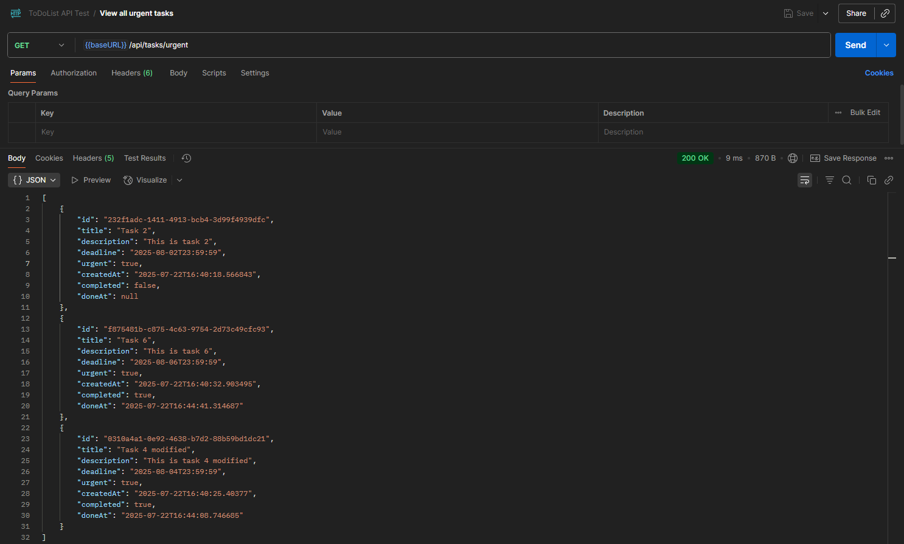

# PRJ-ToDoList

## 1. Description
- Developed RESTful API for managing tasks using Java and Spring Boot. Implemented CRUD operations, filtering, and completion status updates with Spring Web MVC. Integrated PostgreSQL via Spring Data JPA.

- Tech Stack: Java 17, Spring Boot, Spring MVC, Spring Data JPA, PostgreSQL, Maven, Git, Lombok

## 2. API Function Table

<table style="font-size: 12px;">  
  <thead>  
    <tr>  
      <th style="text-align: center; font-size: 17px; font-weight: bold">Function Name</th>  
      <th style="text-align: center; font-size: 17px; font-weight: bold">Description</th>  
      <th style="text-align: center; font-size: 17px; font-weight: bold">API URL</th>  
      <th style="text-align: center; font-size: 17px; font-weight: bold">API Image Demo</th>  
    </tr>  
  </thead>  
  <tbody>  
    <!-- Add Task -->  
    <tr style="text-align: center; font-size: 20px; font-weight: bold; color: goldenrod">  
      <td colspan="4">Add Task</td>  
    </tr>  
    <tr>  
      <td>Add Task</td>  
      <td>Create a new task</td>  
      <td>POST http://localhost:8080/api/tasks</td>  
      <td></td>  
    </tr>
    <!-- View Tasks -->  
    <tr style="text-align: center; font-size: 20px; font-weight: bold; color: forestgreen">  
      <td colspan="4">View Tasks</td>  
    </tr>  
    <tr>  
      <td>View All Tasks</td>  
      <td>Get all tasks</td>  
      <td>GET http://localhost:8080/api/tasks</td>  
      <td></td>  
    </tr>  
    <tr>  
      <td>View Task by ID</td>  
      <td>Get task by ID</td>  
      <td>GET http://localhost:8080/api/tasks/id/{id}</td>  
      <td></td>  
    </tr>  
    <tr>  
      <td>View All Completed Tasks</td>  
      <td>Get only completed tasks</td>  
      <td>GET http://localhost:8080/api/tasks/completed</td>  
      <td></td>  
    </tr>  
    <tr>  
      <td>View All Incomplete Tasks</td>  
      <td>Get tasks not completed</td>  
      <td>GET http://localhost:8080/api/tasks/incomplete</td>  
      <td></td>  
    </tr>  
    <tr>  
      <td>View All Urgent Tasks</td>  
      <td>Get only urgent tasks</td>  
      <td>GET http://localhost:8080/api/tasks/urgent</td>  
      <td></td>  
    </tr>  
    <tr>  
      <td>View All Non-Urgent Tasks</td>  
      <td>Get tasks not marked urgent</td>  
      <td>GET http://localhost:8080/api/tasks/nonurgent</td>  
      <td></td>  
    </tr>
    <!-- Update Task -->  
    <tr style="text-align: center; font-size: 20px; font-weight: bold; color: cornflowerblue">  
      <td colspan="4">Update Task</td>  
    </tr>  
    <tr>  
      <td>Update Task</td>  
      <td>Update task content</td>  
      <td>PUT http://localhost:8080/api/tasks/update/{id}</td>  
      <td></td>  
    </tr>  
    <tr>  
      <td>Mark Task as Done</td>  
      <td>Update task as completed</td>  
      <td>PUT http://localhost:8080/api/tasks/completed/{id}</td>  
      <td></td>  
    </tr>
    <!-- Delete Task -->  
    <tr style="text-align: center; font-size: 20px; font-weight: bold; color: darkred">  
      <td colspan="4">Delete Task</td>  
    </tr>  
    <tr>  
      <td>Delete Task</td>  
      <td>Remove task by ID</td>  
      <td>DELETE http://localhost:8080/api/tasks/delete/{id}</td>  
      <td></td>  
    </tr>  
  </tbody>  
</table>
